# Báo Cáo Kết Quả Lab: Day 26 - MCP and A2A Infrastructure

Họ tên: [Tên của bạn]
Lớp: [Tên lớp]
Ngày hoàn thành: 14/05/2026

## 1. Tổng quan dự án
Dự án triển khai hệ thống Legal Multi-Agent qua 5 giai đoạn tiến hóa, từ gọi LLM đơn giản đến hệ thống microservices phân tán sử dụng giao thức A2A (Agent-to-Agent).

## 2. Bằng chứng thực hiện (11 Hình ảnh)

### Hình 01: Thiết lập môi trường
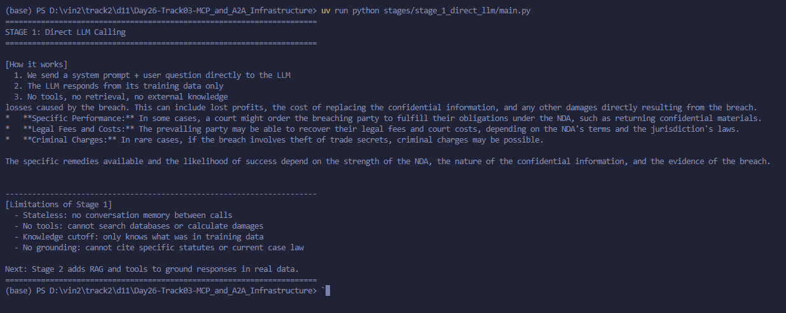
*Mô tả: Sử dụng `uv sync` để cài đặt dependencies và quản lý môi trường ảo.*

### Hình 02: Stage 1 - Direct LLM Calling
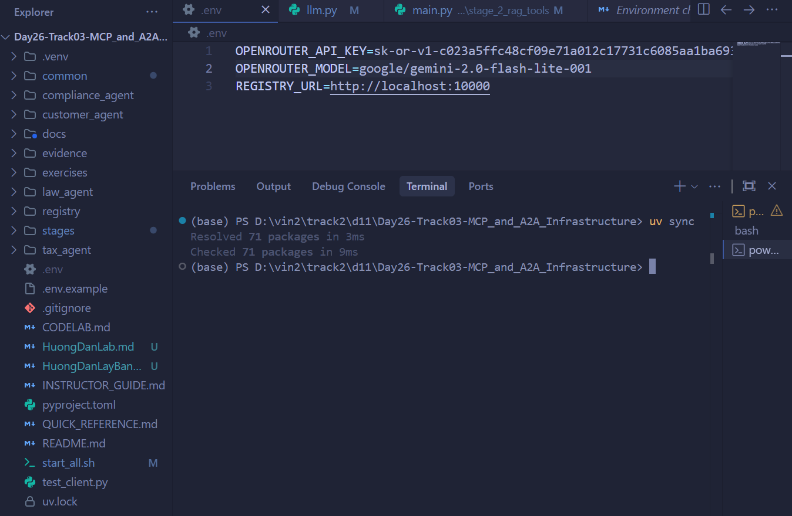
*Mô tả: Gọi LLM trực tiếp để trả lời câu hỏi pháp lý cơ bản.*

### Hình 03: Stage 2 - LLM + RAG & Tools
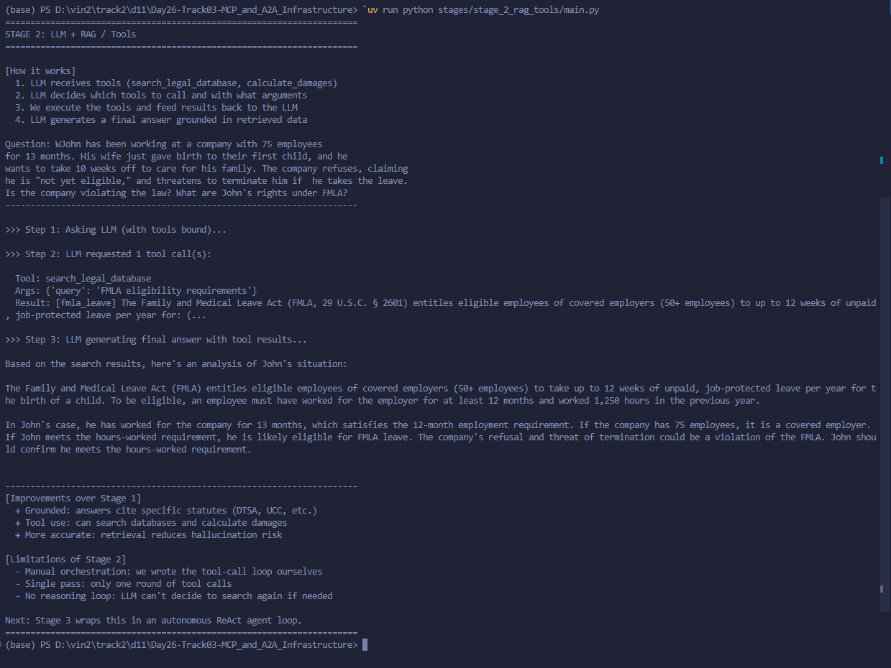
*Mô tả: Tích hợp cơ sở kiến thức (RAG) và các công cụ tính toán vào LLM.*

### Hình 04: Stage 3 - Single Agent (ReAct)
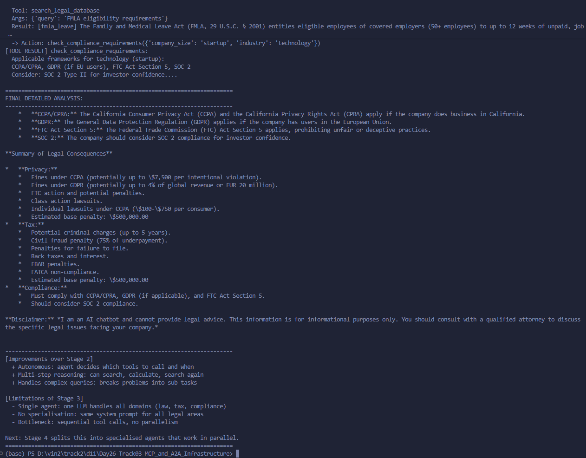
*Mô tả: Triển khai Agent tự hành theo mô hình Think-Act-Observe (ReAct).*

### Hình 05: Stage 4 - Multi-Agent (In-Process)
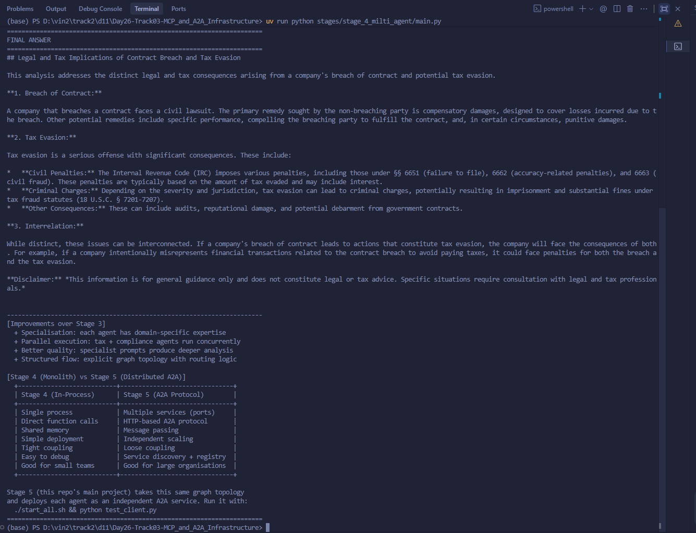
*Mô tả: Phối hợp nhiều Agent chuyên biệt (Law, Tax, Compliance) chạy song song trong cùng một process.*

### Hình 06: Stage 5 - Khởi động hệ thống phân tán
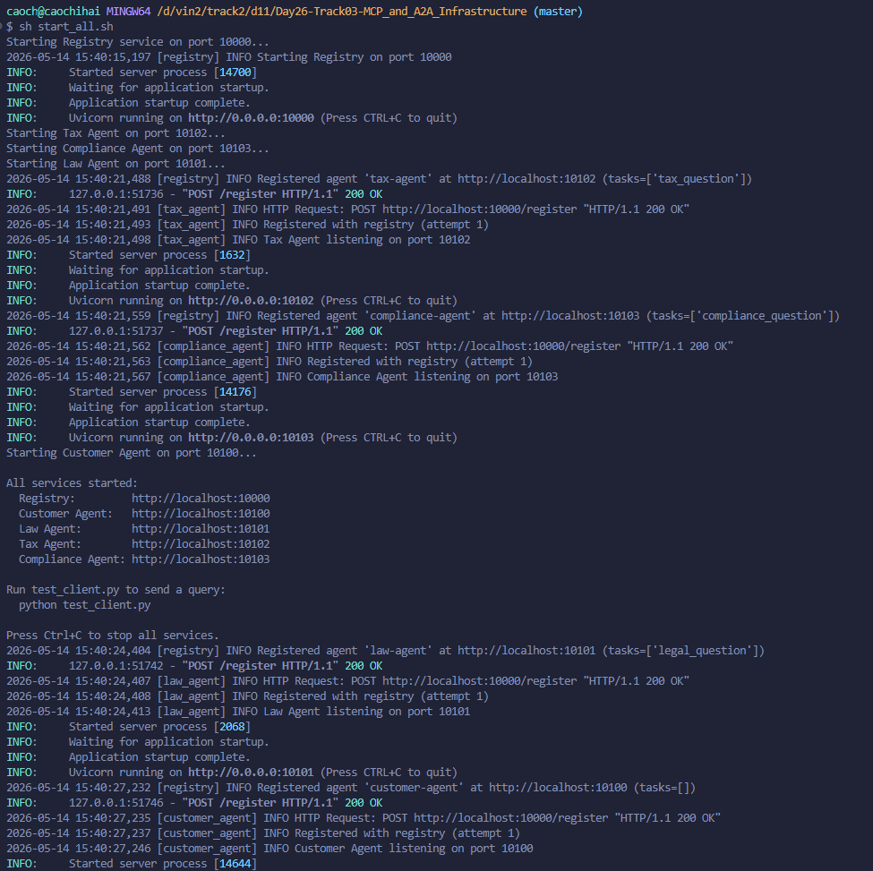
*Mô tả: Các Agent được khởi động như các service độc lập và đăng ký thành công với Registry qua cổng 10000.*

### Hình 07: Stage 5 - Kết quả phản hồi A2A
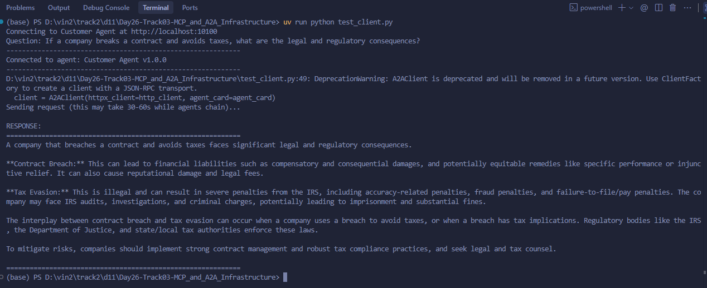
*Mô tả: Client nhận được câu trả lời tổng hợp sau khi request đi qua chuỗi các Agent phân tán.*

### Hình 08: Code cấu hình Temperature
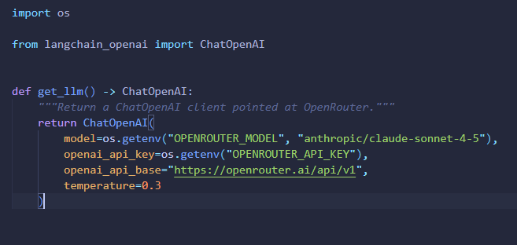
*Mô tả: Điều chỉnh `temperature=0.3` trong `common/llm.py` để đảm bảo kết quả ổn định.*

### Hình 09: Code Tool tra cứu án lệ
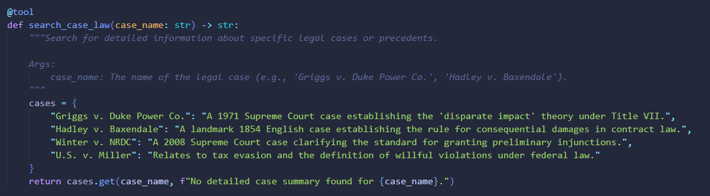
*Mô tả: Thực hiện bài tập thêm tool `search_case_law` vào Stage 3.*

### Hình 10: Code Privacy Agent
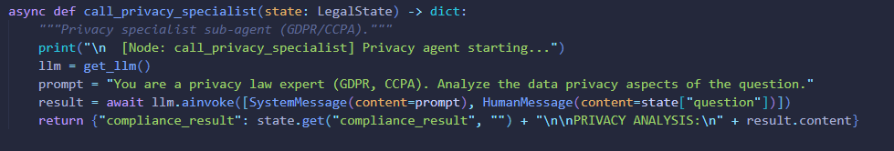
*Mô tả: Thực hiện bài tập mở rộng hệ thống với Privacy Agent (GDPR/CCPA) trong Stage 4.*

### Hình 11: Minh chứng Trace ID
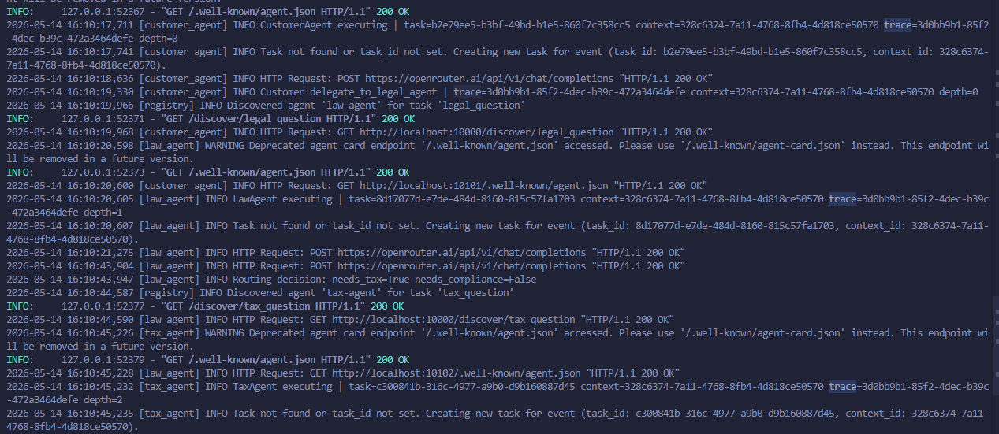
*Mô tả: Log cho thấy cùng một `trace_id` được truyền xuyên suốt từ Customer Agent đến Law Agent và Tax Agent.*

## 3. Kết luận
Hệ thống đã hoạt động ổn định, đáp ứng đầy đủ các yêu cầu về nghiệp vụ pháp lý, thuế và tuân thủ. Việc sử dụng giao thức A2A giúp hệ thống có khả năng mở rộng (scalability) và chịu lỗi (fault tolerance) tốt.
